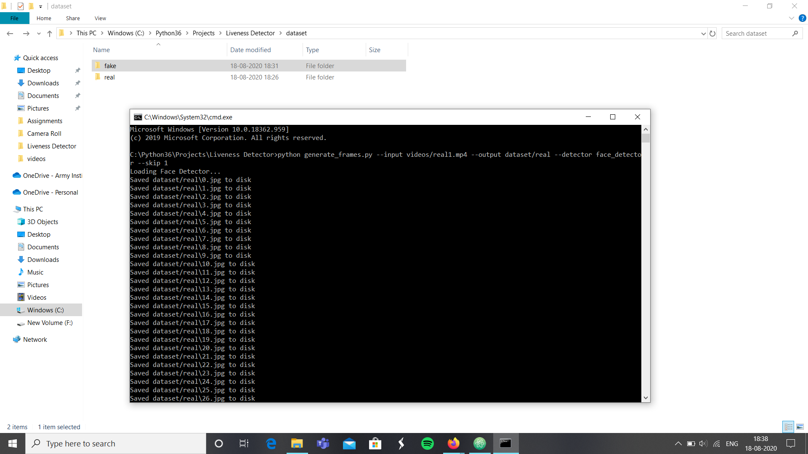
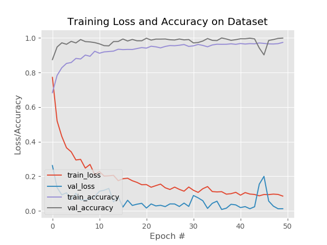
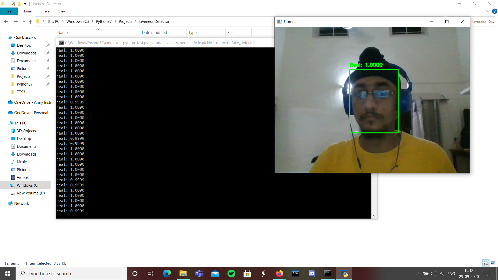
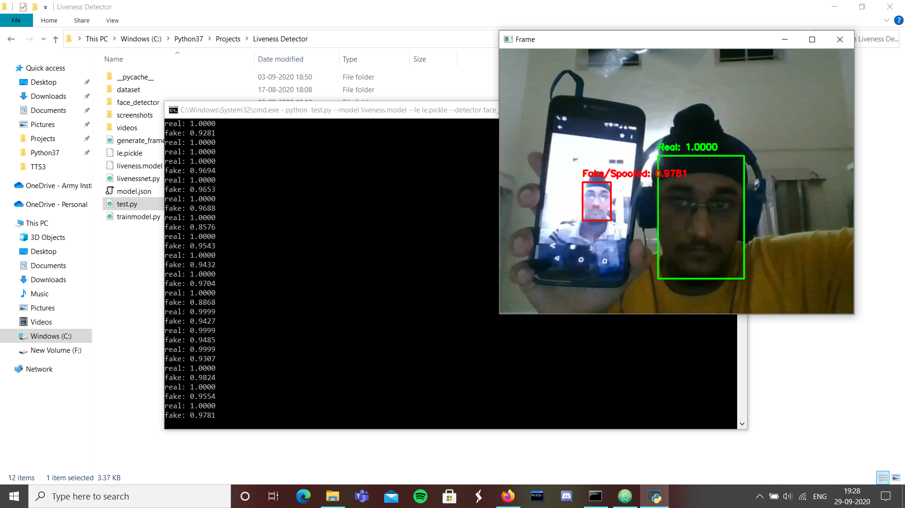

# Liveness-Detector
A liveness detector capable of spotting fake faces and performing anti-face spoofing in face recognition systems.

## Program Structure
* dataset
  * fake_images
  * real_images
* face_detector
  * deploy.prototxt
  * res10_300x300_ssd_iter_140000.caffemodel
* videos
  * fake_generated_videos
  * real_generated_videos
* generate_frames.py
* le.pickle
* liveness.model
* livenessnet.py
* test.py
* trainmodel.py

There are three main directories in the project:
1. dataset: This directory consists of two classes of images:
        Fake images captured from a camera aimed at the screen while playing a video of some face.
        Real images captured from a selfie video with the phone.
2. face_detector: Consists of our pretrained Caffe face detector to locate face ROIs.
3. videos: The videos are collected from people where they first capture themselves on their phones and then that video is captured on a laptop gain to generate fake frames

## Process:
1. Collect videos from friends of themselves of around 10-15 seconds.These are the <strong>"real"</strong> videos.
2. Create <strong>"fake"</strong> videos by capturing the real videos on your laptop by playing them on your phone.
3. Manually arrange them into subdirectories of real and fake in the videos folder.
4. Run the <strong>generate_frames.py</strong> script in the terminal/cmd to generate image frames of the videos, whilst manually arranging the generated images into subdirectories in the dataset directories.
    To run:  &ensp;&ensp;&ensp; i. for real videos <strong><code>python generate_frames.py --input videos/real1.mp4 --output dataset/real --detector face_detector --skip 1</code></strong>
    To run:  &ensp;&ensp;&ensp; ii. for fake videos <strong><code>python generate_frames.py --input videos/fake1.mp4 --output dataset/fake --detector face_detector --skip 4</code></strong>
      Here skip is used to skip N frames between detections because adjacent frames will be similar.

5. Run the <strong>trainmodel.py</strong> script by typing in the terminal/cmd: <strong><code>python trainmodel.py --dataset dataset --model liveness.model --le le.pickle</code></strong>

6. After training the model, run the <strong>test.py</strong> script by typing in the terminal/cmd: <strong><code>python test.py --model liveness.model --le le.pickle --detector face_detector</code></strong>

## Things to take care of:
To make sure you do not get an imbalanced dataset, set the skip rate accordingly while running the <strong>generate_frames.py</strong> script.

## Scope:
1. Can be implemented in Face Recognition systems in companies and can be used for face unlocking in phones.
2. The current liveness detection can be combined with eye blink detection(using facial landmark detector and setting an eye blink threshold) which will be feasible to filter out most of the remaining cases.
